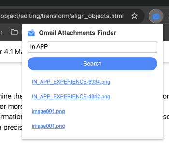

# Gmail Attachments Finder
Chrome extension for quick access to your gmail attachments

## Description
The **Gmail Attachments Finder** is a Google Chrome extension that allows you to quickly find your attachments by searching for specific keywords in your emails. With this extension, you can easily locate the attachments you need and download them with just a few clicks.

## Features
- Search by keyword: Enter a keyword related to the attachment you are looking for, and the extension will filter your emails to display only those with matching attachments.
- Download attachments: Once you have located the desired attachment, you can download it directly to your computer with a single click.

## Installation
To install the Gmail Attachments Finder extension, follow these steps:
1. Clone the repository
2. Add YOUR_CLIENT_ID and YOUR_PUBLIC_KEY_FROM_CHROME_WEB_STORE into [manifest.json](./src/manifest.json) file
3. Load unpacked extension into Google Chrome

## Preview

## License
This project is licensed under the MIT License. See the [LICENSE](LICENSE) file for more information.
